## AML Job Execution:
```az ml job create -f azure-ml-job.yaml --resource-group my-resource-group --workspace-name my-workspace-name --set inputs.uvs_resource_key="my-computer-vision-key1"```

## Overview
This is a solution accelerator to bridge the gap between Azure Machine Learning (AML) and Azure AI Vision to easily train and evaluate a custom [Multimodal Foundational Model - Florence](https://azure.microsoft.com/en-us/blog/announcing-a-renaissance-in-computer-vision-ai-with-microsofts-florence-foundation-model/) using familiar Data Science tools (such as AML DataAssets, CLIv2 or MLFlow).

The high-level features are: 
- Full control originating from a single yaml file, leveraging the CLI v2
- Built-in AML functionalities, such as direct usage of AML Dataset or comparison of metrics across different AML jobs
- Model Training and/or Inference in Azure AI Vision Studio

The result of a trained model in the AI Vision Studio looks as follows:
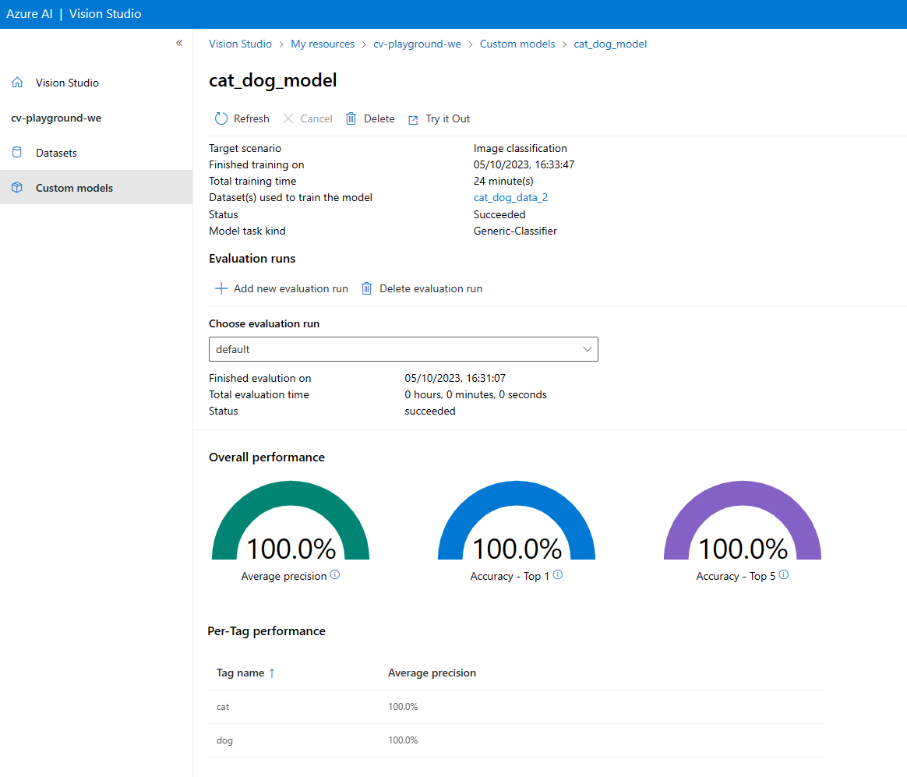


## How to use this repo
### Prerequisites:
- **Azure Subscription - [Free trial](https://azure.microsoft.com/en-in/free/)**
- **[Azure Machine Learning Workspace](https://learn.microsoft.com/en-us/azure/machine-learning/quickstart-create-resources?view=azureml-api-2)**
- **[Azure AI Vision](https://azure.microsoft.com/en-us/products/ai-services/ai-vision/)**
- **[Azure Storage Account](https://learn.microsoft.com/en-us/azure/storage/common/storage-account-create?tabs=azure-portal)** - you can either create a new resource or reuse Storage Account automatically created by AML Workspace
- **[Azure ML CLI v2](https://learn.microsoft.com/en-us/azure/machine-learning/how-to-configure-cli?view=azureml-api-2&tabs=public)** - you will need this to run a training job against AML Workspace

### Preparations for Model Training:
- #### Clone the repository
- #### Prepare, upload and register the dataset in AML
  - Create a new Container in Storage Account and name it `cats-dogs`
    - 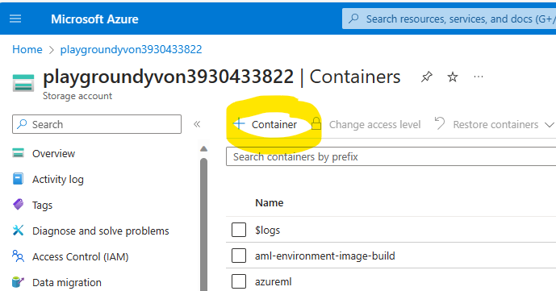
    - 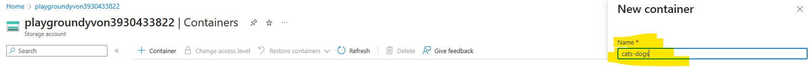
  - Modify `coco_url` fields in [coco json file](aml-pipeline/data/cats_dogs/coco_info.json) by running:   
    ```python adjust_coco.py -s 'your_storage_account_name'``` --> Make sure the `coco_url` shows the correct blob url path
  - Upload your adjusted coco json file and associated images to the newly created Blob Container `cats-dogs`   
  - Register DataStore and DataAsset in AML
    - Create a DataStore: Go to AML workspace -> Data -> Datastores
      - 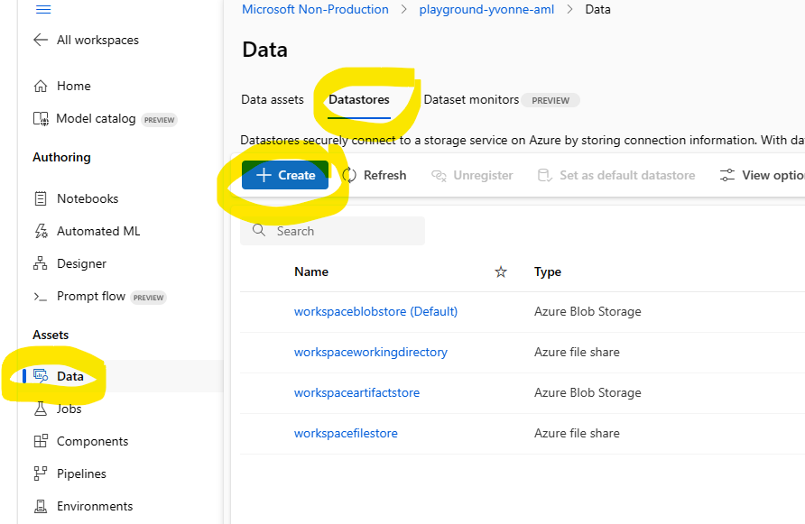
      - We suggest to name the datastore ´cats_dogs_datastore´, select the storage account with the previously created ´cats-dogs´ container and copy the account key from the storage account "Access keys" 
        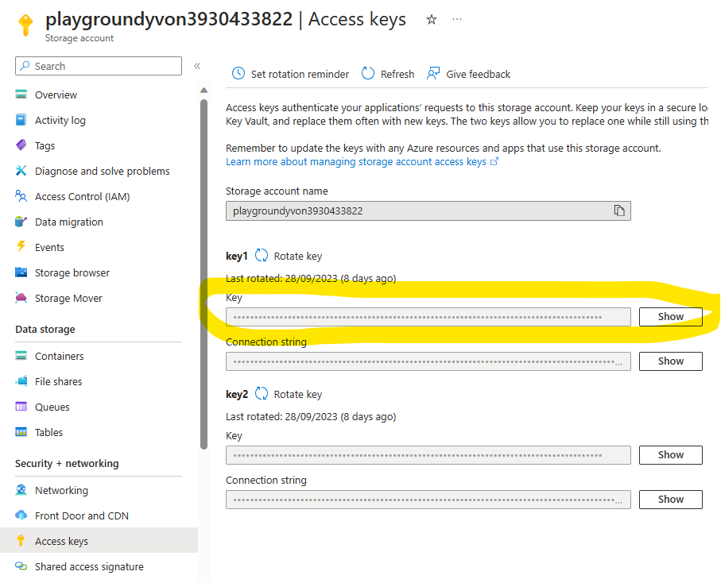
    - Create a DataAsset: Go to AML workspace -> Data -> Data assets
      - 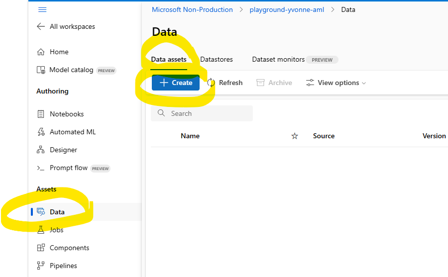
      - 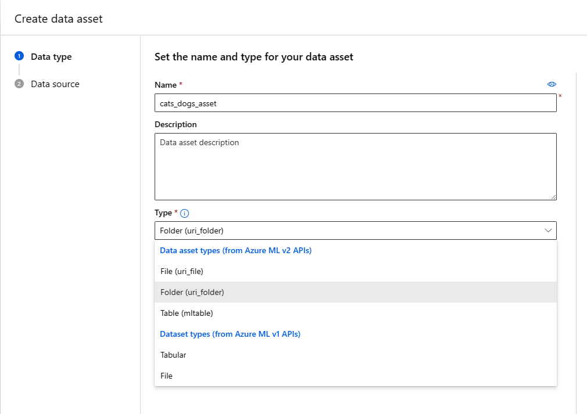
      - 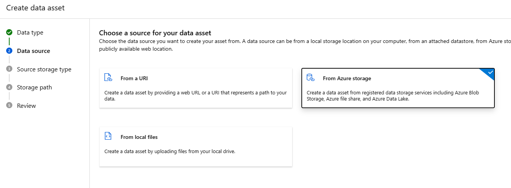
      - 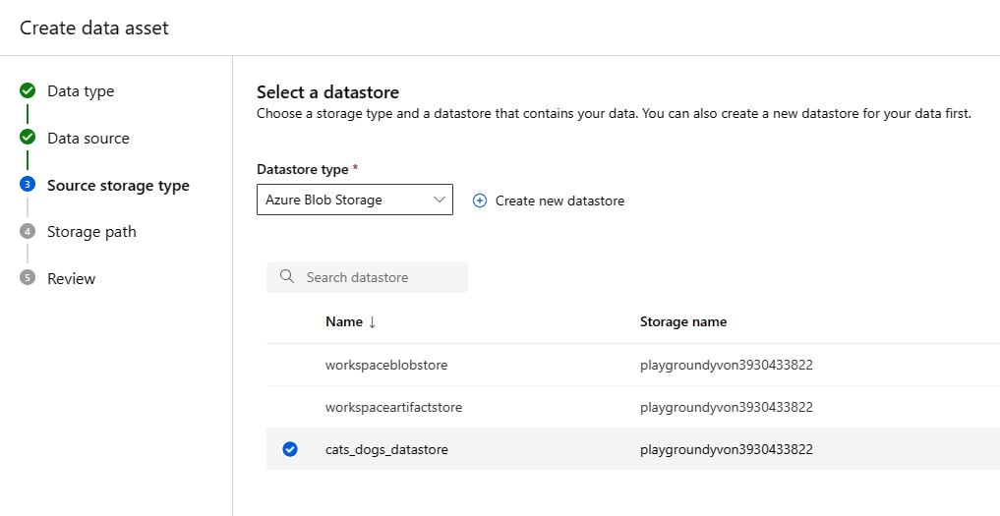
      - 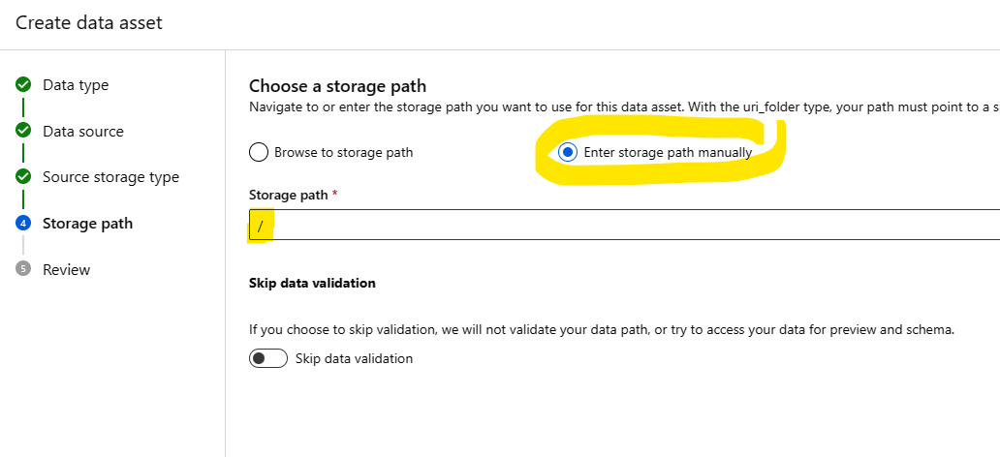
      - 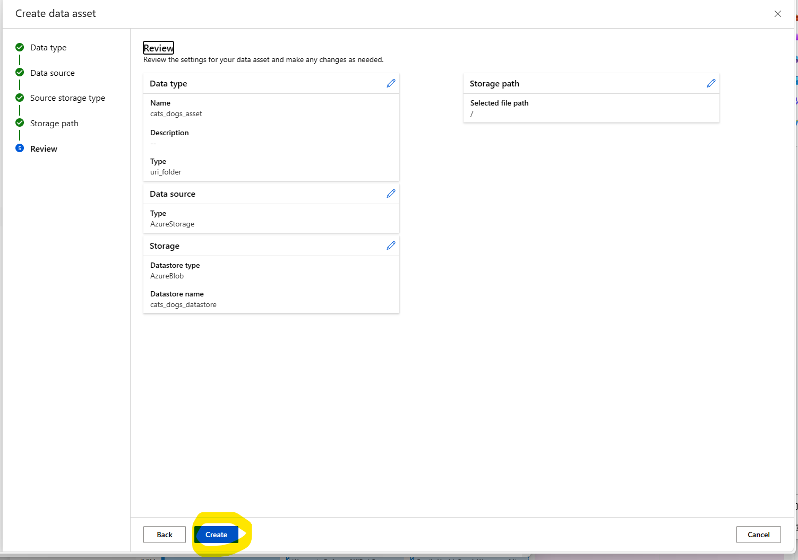
    - 

- #### Enable Azure AI Vision service access to your data  
  In order for Azure AI Vision service to safely access files in your Azure Storage you need to assign `Storage Blob Data Contributor` role to it:
  - First you need to enable Managed Identity on your Azure AI Vision resource:  
    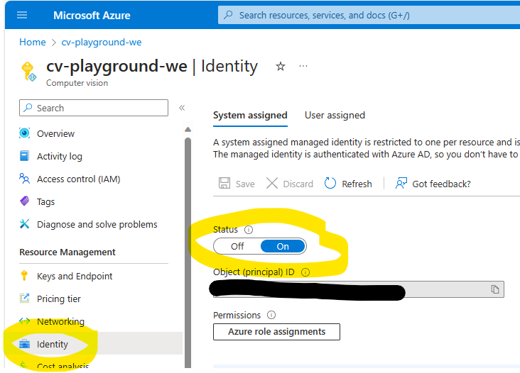
  - Next, assign `Storage Blob Data Contributor` role to Computer Vision resource Managed Identity:
    - Select Role   
      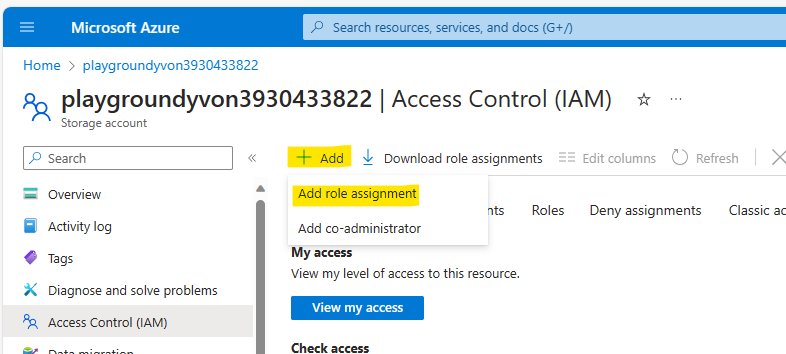
    - Select Storage Blob Data Contributor   
      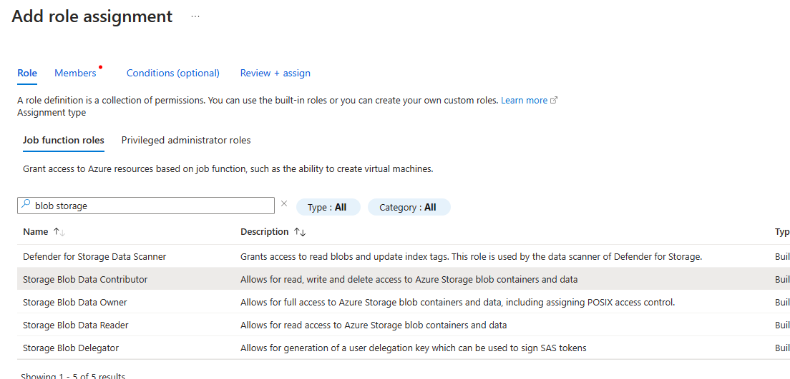
    - Assign access to Managed Identity   
      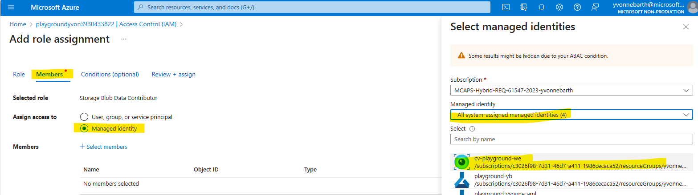
    - Review and Assign   
      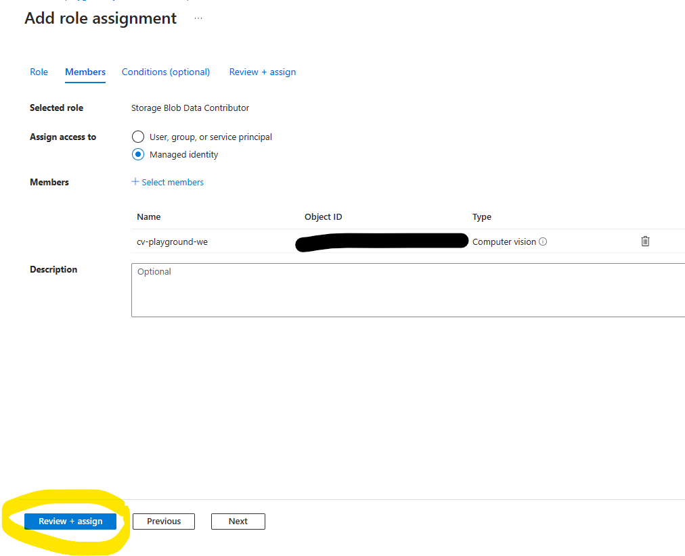

As soon as you completed the above mentioned steps, you can submit a AML job with the following command:
```az ml job create -f azure-ml-job.yaml --resource-group my-resource-group --workspace-name my-workspace-name --set inputs.uvs_resource_key="my-computer-vision-key1"```